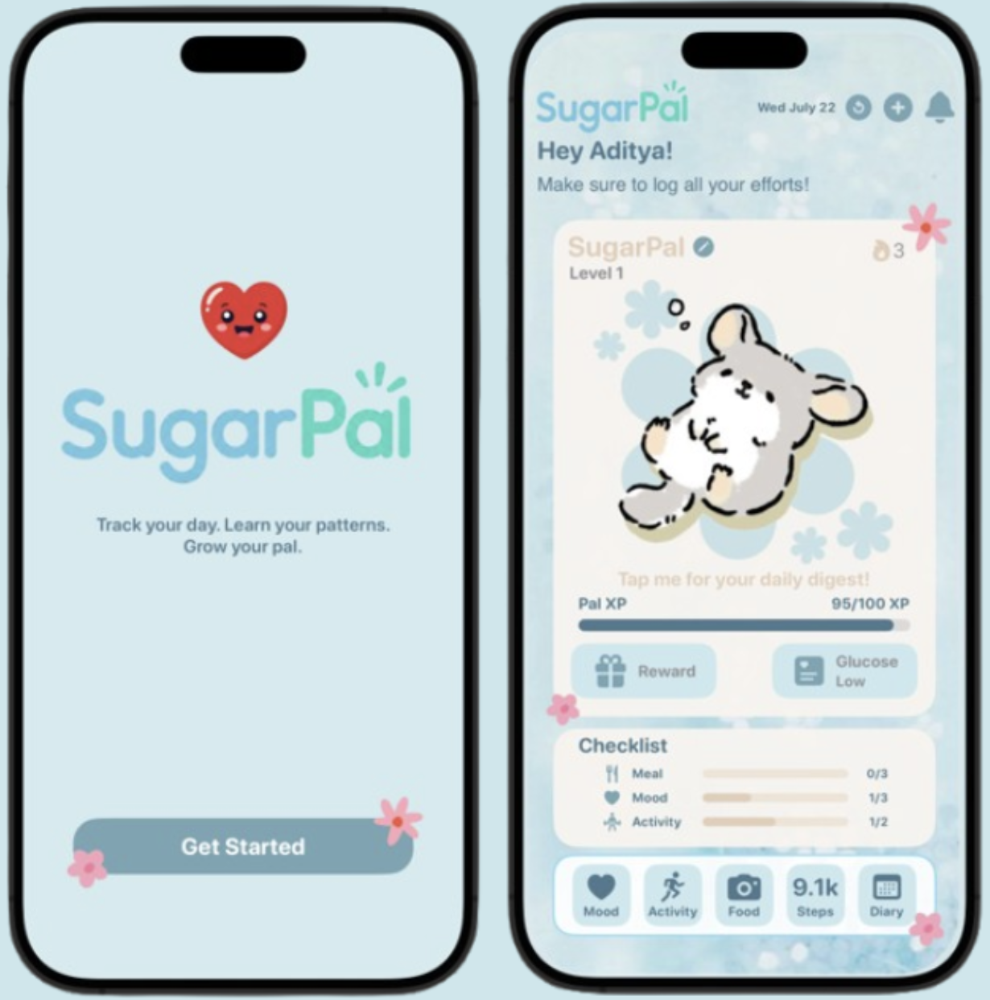
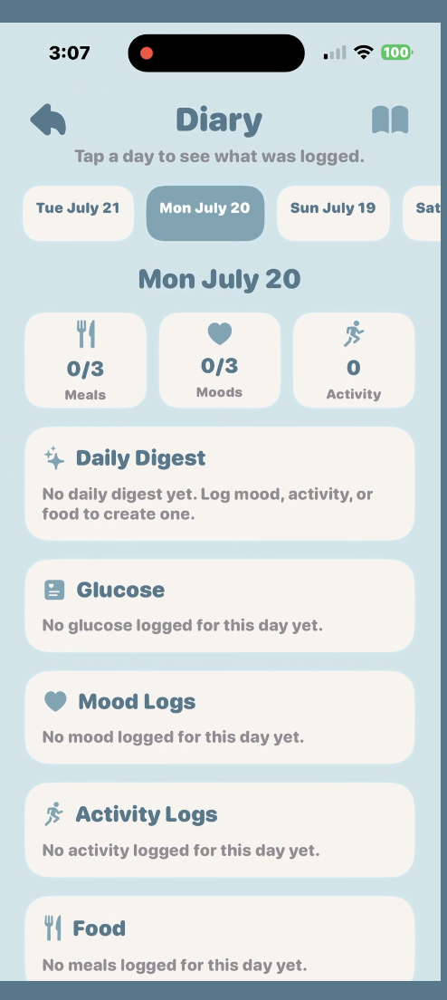

# SugarPal

## Diabetes Companion App for Kids and Teens

SugarPal is a kid friendly diabetes companion app prototype for kids and teens with Type 1 diabetes. The app helps users log food, mood, energy, activity, and glucose information in a simple and visual way. Instead of making kids type long food diaries or read adult-style medical charts, SugarPal uses quick buttons, simple screens, food logging, and daily summaries to help users understand their day.

The app does **not** give medical advice, calculate insulin doses, diagnose anything, or replace a doctor. Its purpose is to help kids understand possible patterns between food, feelings, activity, and glucose in a simple and motivating way.

---

## App Screenshots

### Home Screen and Loading Screen


### AI Food Log


### Diary


---

## Who It Is For

SugarPal is designed for kids and teens with Type 1 diabetes, especially those who are starting to become more independent but still need support from parents, caregivers, and healthcare professionals.

The app is also useful for parents and caregivers because it can keep an organized history of the child’s daily logs. In the future, this could help adults look back at food, mood, activity, glucose, and insulin-related records during checkups or emergency situations.

---

## Problem

Diabetes management can be overwhelming for kids. Many existing diabetes apps are useful, but they often feel like they are made for adults, parents, or doctors. They usually focus on numbers, charts, reports, and medical data.

For a younger user, this can make tracking feel like homework. It can also make it harder for kids to understand the “why” behind their glucose numbers.

SugarPal tries to solve this by making tracking faster, more visual, and more encouraging. The goal is to help kids build a habit of logging their day while also learning how food, mood, activity, and glucose may connect.

---

## How the App Works

A user can log parts of their day such as food, mood, activity, and glucose information. The app saves this information into a diary/history screen so the user can look back at previous days.

The main idea is that a child should not have to answer a long list of complicated questions. Instead, they should be able to use quick buttons, simple screens, and visual logging to record what happened during the day.

In a more advanced version, SugarPal could connect with a CGM or glucose app to automatically bring in glucose data. It could also pair that data with food, activity, energy, and mood logs to create a better daily summary.

---

## Daily Digest

The Daily Digest is one of the main features of SugarPal. It is not a chatbot conversation. It is a short daily summary created from the user’s logs.

The digest explains possible patterns in a kid-friendly way. It can celebrate consistency, point out patterns worth noticing, and suggest showing a parent or diabetes care team if something keeps happening.

Example:

> Today you logged breakfast, lunch, and one snack. Nice job staying consistent. At lunch, you logged pizza and juice. Later, your glucose was higher than your usual range and you tapped “tired.” Foods like pizza and juice can affect glucose differently for different people. This is not a bad choice. It is just a pattern worth noticing. If this happens again, you may want to show your parent or diabetes care team. This is only a pattern summary, not medical advice.

The Daily Digest does not make medical decisions.

---

## What the AI Does

The AI has a specific role. It does not act like ChatGPT where the user asks medical questions. Instead, it works in the background to organize information and explain patterns in a simple way.

The AI can be used to:

- Create daily recaps from food, mood, activity, and glucose logs
- Use encouraging, kid-friendly language
- Explain possible lifestyle patterns
- Help users notice repeated habits or changes
- Make the app feel more educational instead of just showing raw data
  
---

## AI Testing With LM Studio

For the AI part of the project, I explored using LM Studio to test local AI models. LM Studio allowed me to run a local language model on my computer and test how SugarPal could generate a Daily Digest from user logs.

The basic idea was:

1. The app collects daily logs such as food, mood, activity, and glucose information.
2. The data is sent to an AI model through a backend or local server.
3. The AI creates a short Daily Digest.
4. The app shows the summary to the user in a safe and kid-friendly way.

I also learned that an app should not directly handle private API keys. A better structure would be:

```text
Swift app → backend server → AI model/API → response back to app
